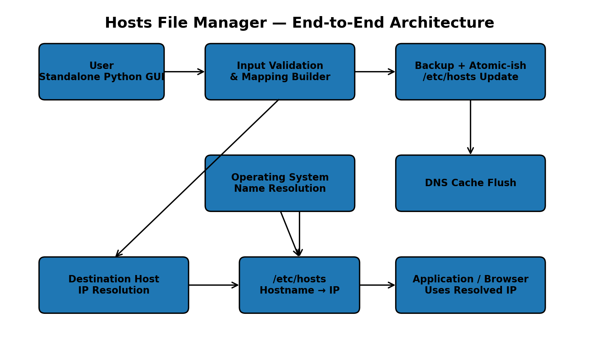

# Hosts File Manager

A standalone Python desktop utility for safely adding hostname mappings
to a system hosts file.

The tool provides a focused graphical interface for:

-   Entering a mandatory change comment.
-   Adding multiple source-to-destination mappings.
-   Previewing the exact hosts entries before modification.
-   Creating a timestamped backup.
-   Resolving destination hostnames to IP addresses.
-   Updating `/etc/hosts`.
-   Flushing the operating system DNS cache.
-   Reporting success or failure through the GUI.

> **Run the tool with only:** `python3 host_manager.py`

------------------------------------------------------------------------

## Table of Contents

1.  [What This Tool Does](#what-this-tool-does)
2.  [What `/etc/hosts` Is](#what-etchosts-is)
3.  [How Name Resolution Works](#how-name-resolution-works)
4.  [Architecture](#architecture)
5.  [UI Overview](#ui-overview)
6.  [Mapping Model](#mapping-model)
7.  [Example](#example)
8.  [Important URL Behavior](#important-url-behavior)
9.  [Source Normalization](#source-normalization)
10. [Destination Resolution](#destination-resolution)
11. [Backup and Change Safety](#backup-and-change-safety)
12. [DNS Cache Flushing](#dns-cache-flushing)
13. [Validation](#validation)
14. [Duplicate Protection](#duplicate-protection)
15. [Privilege Handling](#privilege-handling)
16. [Failure Behavior](#failure-behavior)
17. [Platform Considerations](#platform-considerations)
18. [Security Considerations](#security-considerations)
19. [Operational Workflow](#operational-workflow)
20. [Troubleshooting](#troubleshooting)
21. [Design Principles](#design-principles)
22. [Limitations](#limitations)

------------------------------------------------------------------------

## What This Tool Does

The application is a **local hosts-file management utility**.

It does not operate as a web server.

It does not require:

-   Flask
-   FastAPI
-   Django
-   A browser
-   A database
-   A background service
-   A separate frontend

The application is a single Python program with a graphical user
interface.

Its primary job is converting user input such as:

``` text
Source:      www.example.com
Destination: 203.0.113.20
```

into a hosts-file entry:

``` text
203.0.113.20    www.example.com
```

The operating system can then use that mapping during hostname
resolution.

------------------------------------------------------------------------

## What `/etc/hosts` Is

The hosts file is a local operating-system configuration file.

On Unix-like systems, it is commonly:

``` text
/etc/hosts
```

Its basic structure is:

``` text
IP_ADDRESS    HOSTNAME
```

For example:

``` text
127.0.0.1     localhost
203.0.113.20  example.test
```

This means:

``` text
example.test
      ↓
203.0.113.20
```

The hosts file is consulted by the operating system's name-resolution
stack.

It is therefore useful for:

-   Local development.
-   Testing.
-   Temporary hostname overrides.
-   Internal environments.
-   Blocking selected hostnames.
-   Redirecting hostname resolution to a controlled IP.

It is **not** an HTTP redirect mechanism.

------------------------------------------------------------------------

## How Name Resolution Works

A simplified request flow looks like this:

``` text
Application
    │
    │ asks for www.example.com
    ▼
Operating System Resolver
    │
    ├── local hosts configuration
    │
    └── DNS resolver
          │
          ▼
       DNS server
```

The exact lookup order depends on the operating system and resolver
configuration.

A hosts-file entry can therefore override normal DNS resolution for a
hostname.

### Example

Suppose the hosts file contains:

``` text
203.0.113.20    www.example.com
```

An application resolving:

``` text
www.example.com
```

may receive:

``` text
203.0.113.20
```

instead of the address returned by public DNS.

------------------------------------------------------------------------

## Architecture



The major stages are:

1.  User enters a mapping.
2.  The GUI validates the input.
3.  Destination hostnames are resolved.
4.  A backup is created.
5.  New entries are appended.
6.  The DNS cache is flushed.
7.  The GUI reports the result.

The important distinction is:

``` text
Hostname mapping
        ≠
HTTP URL redirection
```

The hosts file only participates in hostname resolution.

------------------------------------------------------------------------

## UI Overview

The interface is deliberately focused around four areas:

1.  **Comment**
2.  **Domain mappings**
3.  **Preview**
4.  **Update action**


### Comment

Every change requires a comment.

Example:

``` text
Redirect NDTV for testing
```

The comment becomes:

``` text
# Redirect NDTV for testing
```

This creates useful audit context inside the hosts file.

### Domain mappings

Each row contains:

``` text
SOURCE → DESTINATION
```

Example:

``` text
www.example.com → 203.0.113.20
```

Rows can be added or removed dynamically.

### Preview

Before applying changes, the interface displays the resulting hosts
entries.

This reduces accidental modifications.

### Update

The update action:

1.  Validates the mappings.
2.  Creates a backup.
3.  Appends the comment.
4.  Appends the mappings.
5.  Attempts to flush DNS.
6.  Reports the result.

------------------------------------------------------------------------

## Mapping Model

Each mapping is represented internally as:

``` text
(destination IP, source hostname)
```

For example:

``` text
("203.0.113.20", "www.example.com")
```

The hosts-file representation becomes:

``` text
203.0.113.20    www.example.com
```

This ordering is important.

The hosts file expects:

``` text
IP → hostname
```

The UI intentionally presents:

``` text
source → destination
```

because that is easier to understand from a user's perspective.

------------------------------------------------------------------------

## Example

Suppose the UI contains:

``` text
Comment:
Redirect NDTV to HelloInterview for testing

Source:
www.ndtv.com

Destination:
hellointerview.com
```

The application resolves:

``` text
hellointerview.com
        ↓
destination IP
```

Suppose the resolved address is:

``` text
203.0.113.50
```

The generated hosts entry becomes:

``` text
203.0.113.50    www.ndtv.com
```

The comment is placed above it:

``` text
# Redirect NDTV to HelloInterview for testing
203.0.113.50    www.ndtv.com
```

The actual destination IP will depend on the DNS result at update time.

------------------------------------------------------------------------

## Important URL Behavior

A hosts file does **not** understand complete URLs.

For example:

``` text
https://www.ndtv.com/india-news/article?id=123
```

contains several components:

``` text
Scheme:       https
Hostname:     www.ndtv.com
Path:         /india-news/article
Query:        id=123
```

The hosts file only sees:

``` text
www.ndtv.com
```

It cannot see or modify:

``` text
/india-news/article
?id=123
```

Therefore this mapping:

``` text
www.ndtv.com → hellointerview.com
```

does **not** mean:

``` text
https://www.ndtv.com/anything
        ↓
https://hellointerview.com/anything
```

Instead, it means:

``` text
www.ndtv.com
        ↓
destination IP
```

The browser still believes it is communicating with:

``` text
www.ndtv.com
```

This distinction is especially important with HTTPS.

------------------------------------------------------------------------

## HTTPS and Certificates

HTTPS validates the server's certificate against the hostname.

For example, the browser requests:

``` text
https://www.ndtv.com
```

The browser expects a certificate valid for:

``` text
www.ndtv.com
```

If hosts resolution sends that connection to another server, that server
may present:

``` text
hellointerview.com
```

The certificate may therefore not match.

The result can be:

``` text
Certificate hostname mismatch
```

or another TLS validation failure.

This is expected behavior.

A hosts-file change does not rewrite HTTPS identity.

------------------------------------------------------------------------

## Source Normalization

The application accepts a source such as:

``` text
www.example.com
```

It also tolerates a URL-style value such as:

``` text
https://www.example.com/path
```

The application extracts the hostname:

``` text
www.example.com
```

It removes URL-specific components such as:

``` text
https://
/path
?query=value
#fragment
```

This is intentional because those components do not belong in
`/etc/hosts`.

------------------------------------------------------------------------

## Destination Resolution

Destinations can be supplied as:

``` text
203.0.113.20
```

or as a hostname:

``` text
hellointerview.com
```

### IP destination

If an IP address is provided, it can be written directly.

Example:

``` text
203.0.113.20
```

### Hostname destination

If a hostname is provided, the application resolves it first.

Example:

``` text
hellointerview.com
        ↓
DNS resolution
        ↓
203.0.113.20
```

The hosts file stores the resulting IP.

This matters because DNS addresses can change.

A mapping created today may therefore differ from one created later.

------------------------------------------------------------------------

## Backup and Change Safety

The application creates a backup before modifying the hosts file.

The backup follows this general pattern:

``` text
/etc/hosts.backup_YYYYMMDD_HHMMSS
```

Example:

``` text
/etc/hosts.backup_20261005_183000
```

The backup provides a recovery point.

### Recommended operational practice

Keep backups until the change has been verified.

Do not delete a backup immediately after a successful update.

------------------------------------------------------------------------

## DNS Cache Flushing

Operating systems and applications may cache hostname resolutions.

Changing `/etc/hosts` does not necessarily invalidate every existing
cache.

The application therefore attempts to flush the system DNS cache.

### macOS

The script attempts the macOS resolver commands.

### Linux

The script attempts common resolver-cache commands.

### Windows

The script uses the Windows DNS cache command.

Availability depends on the operating system and installed resolver
services.

The application reports when no supported cache-flush command is
available.

------------------------------------------------------------------------

## Validation

The application validates mappings before changing the hosts file.

Validation includes:

-   Empty source detection.
-   Empty destination detection.
-   Hostname format validation.
-   IPv4 validation.
-   IPv6 validation.
-   Destination DNS resolution.
-   At least one valid mapping.

Invalid input stops the update.

The hosts file is not modified when validation fails.

------------------------------------------------------------------------

## Duplicate Protection

The application reads existing hostname entries before adding new
mappings.

If the source hostname already exists, the update is rejected.

For example, if `/etc/hosts` already contains:

``` text
203.0.113.20    www.example.com
```

attempting to add another:

``` text
203.0.113.50    www.example.com
```

is rejected.

This prevents the utility from silently creating competing mappings.

------------------------------------------------------------------------

## Privilege Handling

System hosts files normally require administrator privileges.

The application checks its privileges before opening the GUI.

When elevated privileges are required, it requests them through the
system's administrator mechanism.

This allows the user to launch the script normally rather than manually
modifying the hosts file.

The program still performs its own validation before writing.

------------------------------------------------------------------------

## Failure Behavior

The application handles failures at the GUI level.

Typical failures include:

### Invalid hostname

``` text
Invalid source hostname
```

### Destination cannot resolve

``` text
Could not resolve destination
```

### Existing hostname

``` text
hostname already exists in /etc/hosts
```

### Permission failure

The application reports the inability to modify the hosts file.

### DNS flush unavailable

The hosts update can still succeed.

The UI reports that the DNS flush command was unavailable.

------------------------------------------------------------------------

## Platform Considerations

The application is designed around a Unix-style hosts-file workflow.

The primary target is:

``` text
macOS
```

It also contains platform branching for:

``` text
Linux
Windows
```

The exact DNS cache behavior varies between operating systems.

The hosts-file location also varies.

The current implementation intentionally uses:

``` text
/etc/hosts
```

as the primary target.

------------------------------------------------------------------------

## Security Considerations

This utility modifies a privileged operating-system file.

Treat mappings as system-level configuration.

### Important precautions

-   Review the preview before updating.
-   Use meaningful comments.
-   Keep backups.
-   Avoid unknown destination domains.
-   Do not paste untrusted commands into the script.
-   Do not expose the utility through a network service.
-   Keep the script local.
-   Review existing hosts entries before major changes.

The application does not need a network listener.

That is a deliberate design choice.

------------------------------------------------------------------------

## Operational Workflow

The complete workflow is:

``` text
Launch GUI
    ↓
Enter mandatory comment
    ↓
Add source/destination mappings
    ↓
Preview generated entries
    ↓
Confirm update
    ↓
Validate input
    ↓
Resolve destination hostnames
    ↓
Create backup
    ↓
Append hosts entries
    ↓
Flush DNS cache
    ↓
Report result
```

This keeps the modification path explicit and easy to audit.

------------------------------------------------------------------------

## Troubleshooting

### GUI does not open

The Python installation must include the GUI toolkit used by the script.

If the interpreter reports:

``` text
ModuleNotFoundError: No module named '_tkinter'
```

the Python installation does not currently provide Tk support.

Install the appropriate Tk package for that Python installation.

Then run:

``` text
python3 host_manager.py
```

### Mapping does not appear to work

Check the following:

1.  Verify the hosts entry exists.
2.  Verify the destination IP.
3.  Flush DNS.
4.  Retry the application.
5.  Check whether the application maintains its own DNS cache.
6.  Remember that browsers can maintain independent caches.

### HTTPS fails

This is commonly caused by TLS certificate validation.

A hosts-file change does not change the requested hostname.

For example:

``` text
www.example.com
```

still requires a certificate valid for:

``` text
www.example.com
```

------------------------------------------------------------------------

## Design Principles

The utility follows several production-oriented principles.

### 1. Minimal surface area

There is no server component.

There is no database.

There is no network listener.

### 2. Explicit changes

The user sees the generated entries before applying them.

### 3. Traceability

Every change requires a comment.

### 4. Recoverability

A backup is created before modification.

### 5. Validation first

Invalid mappings are rejected before writing.

### 6. Platform awareness

DNS cache commands are selected according to the operating system.

### 7. Separation of concerns

The GUI collects intent.

Validation verifies input.

Resolution determines destination IPs.

The file writer performs the modification.

The DNS layer handles cache invalidation.

------------------------------------------------------------------------

## Limitations

This utility intentionally does not attempt to become a proxy.

It cannot:

-   Rewrite HTTP URLs.
-   Rewrite URL paths.
-   Rewrite query parameters.
-   Change HTTPS certificates.
-   Perform HTTP 301/302 redirects.
-   Inspect HTTP requests.
-   Modify browser traffic.
-   Proxy arbitrary web content.

For example:

``` text
https://www.ndtv.com/india-news/article
```

cannot be transformed into:

``` text
https://hellointerview.com/india-news/article
```

using `/etc/hosts` alone.

That functionality requires an HTTP/HTTPS-aware proxy or redirecting web
server.

------------------------------------------------------------------------

## Summary

The application provides a controlled graphical interface for managing
local hostname mappings.

The core relationship is:

``` text
Source hostname
      ↓
/etc/hosts
      ↓
Destination IP
      ↓
Operating-system networking
```

It is best suited for:

-   Development.
-   Testing.
-   Local environment overrides.
-   Controlled hostname routing.
-   Temporary system-level mappings.

For URL-level redirects, use a proxy or web server instead of relying on
`/etc/hosts`.

------------------------------------------------------------------------

## Running the Tool

``` bash
python3 host_manager.py
```
